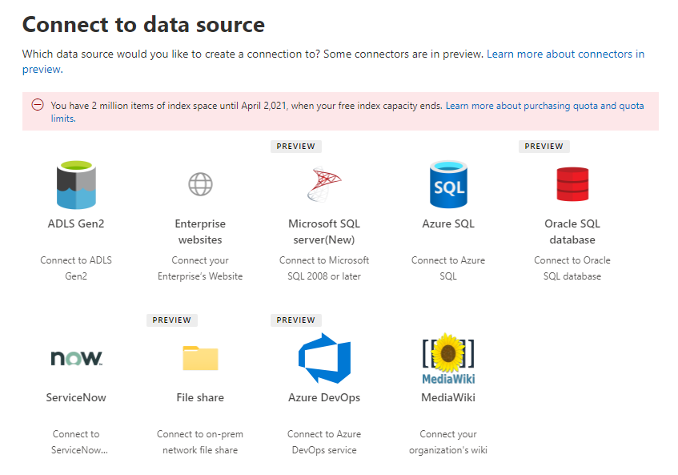
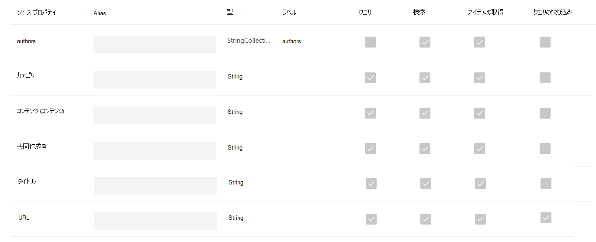

<!-- markdownlint-disable no-trailing-punctuation -->

# Microsoft によるグラフコネクタのセットアップの概要 

この記事では、microsoft [365 管理センター](https://admin.microsoft.com) を使用して、microsoft によってグラフコネクタをセットアップするために必要な基本手順の概要を説明します。 基本的なプロセスには、次の手順が含まれます。  
<!---Add links to each section in the doc--->

1. Microsoft 365 管理センターで Graph connector を追加します。
2. 接続に名前を指定します。
3. 接続設定を構成します。
4. 検索権限を管理します。
5. プロパティのラベルを割り当てます。
6. スキーマを管理します。
7. [設定の更新] を選択します。
8. 接続を確認します。

セットアッププロセスは、Microsoft によってすべての Graph コネクタでよく似ていますが、まったく同じではないことに注意する必要があります。 **この記事を読むだけでなく、データソースのコネクタ固有の情報を必ずお読みください。**  

## 手順 1: Microsoft 365 管理センターで Graph connector を追加する

Microsoft によって作成されたコネクタのいずれかを構成するには、次の手順を実行します。

1. [Microsoft 365 管理センター](https://admin.microsoft.com)で管理者アカウントにサインインする
2. ナビゲーションウィンドウで、[ **設定**] を選択し、[ **Search & 知能**] を選択します。 [ [コネクタ] タブ](https://admin.microsoft.com/Adminportal/Home#/MicrosoftSearch/Connectors)を選択します。
3.  [ **+ 追加**] を選択し、使用可能なオプションのメニューから任意のデータソースを選択します。

>[!注:] 各テナントに最大10個のグラフ接続を追加できます。

## 手順 2: 接続に名前を指定する
次の属性を指定する必要があります。 

* Name  
* 接続 ID 
* 説明 (省略可能) 

接続 ID は、コネクタの暗黙的なプロパティを作成します。 このファイルには、英数字のみが含まれ、最大32文字の文字が含まれている必要があります。 

## 手順 3: 接続設定を構成する

接続設定を構成するプロセスは、データソースの種類によって異なります。 セットアッププロセスでこの手順を実行するには、テナントに追加するデータソースの種類に関するコネクタ固有の情報を参照してください。  

オンプレミスのデータソースへの接続の詳細については、「 [オンプレミスのデータゲートウェイをインストール](https://aka.ms/configuregateway)する」を参照してください。

## 手順 4: 検索権限を管理する

アクセス制御リスト (Acl) は、組織内のどのユーザーがデータの各アイテムにアクセスできるかを決定します。  

[MICROSOFT SQL](MSSQL-connector.md)および[Azure Data Lake Storage Gen2](azure-data-lake-connector.md)などの一部のコネクタでは、 [AZURE Active Directory (azure AD)](https://docs.microsoft.com/azure/active-directory/) acl がネイティブにサポートされています。

[ServiceNow](servicenow-connector.md)、 [azure DevOps](azure-devops-connector.md)、および[Salesforce](salesforce-connector.md)などの他のコネクタは、非 Azure AD ユーザーとグループの同期をサポートしています。  

## 手順 5: プロパティラベルを割り当てる
[プロパティラベルの割り当て] ページでソースプロパティにセマンティックラベルを割り当てることができます。 ラベルは、Microsoft によって提供される、意味的な意味を提供する既知のタグです。 これにより、Microsoft は、拡張検索、people カード、インテリジェントな検出などの Microsoft 365 エクスペリエンスに、コネクタデータを統合することができます。  

次の表に、現在サポートされているラベルとその説明を示します。  

ラベル | 説明
--- | ---  
**title** | 検索やその他のエクスペリエンスに表示するアイテムのタイトル 
**url** | ソースシステム内のアイテムのターゲット url 
**createdBy** | アイテムを作成したユーザーの名前 
**lastModifiedBy** | アイテムを最後に編集したユーザーの名前 
**authors** | アイテムに共同作業しているユーザーの名前 
**createdDateTime** | アイテムが作成された日時 
**lastModifiedDateTime** | アイテムが最後に編集されたのはいつですか 
**fileName** | ファイルアイテムの名前 
**FileExtension** | .Pdf または word などのファイル項目の種類 

このページのプロパティは、データソースに基づいてあらかじめ選択されていますが、特定のラベルにより適した別のプロパティがある場合は、この選択を変更できます。  

ラベル **タイトル** は、最も重要なラベルです。 このラベルには、[結果のクラスター環境](result-cluster.md)に参加するためにプロパティを割り当てることを **強くお勧め** します。

ラベルを誤ってマッピングすると、deteriorated の検索機能が発生します。 プロパティを割り当てられていないラベルもあります。  

## 手順 6: スキーマを管理する

### Content プロパティ

[オプション] ドロップダウンメニューから [* * Content Property] を選択することを強くお勧めします。または、存在する場合は既定値をそのまま使用することをお勧めします。 このプロパティは、コンテンツのフルテキストインデックス作成、検索結果のページスニペット生成、 [結果のクラスター](result-cluster.md) 参加、言語の検出、HTML/テキストのサポート、ランク付けと関連性、およびクエリ formulation に使用されます。

コンテンツプロパティを選択した場合は、[結果の種類を作成](customize-results-layout.md)するときにシステム生成されたプロパティ **resultsnippet** を使用することができます。 このプロパティは、クエリ時に content プロパティから生成される動的スニペットのプレースホルダーとして機能します。 結果の種類でこのプロパティを使用すると、検索結果にスニペットが生成されます。

### ソースプロパティのエイリアスを作成する

[スキーマの管理] ページの [エイリアス] 列の下にあるプロパティにエイリアスを追加することができます。 エイリアスは、プロパティのフレンドリ名です。 クエリとフィルターの作成で使用されます。 また、同じ名前を持つ複数の接続からソースプロパティを正規化するためにも使用されます。 これにより、複数の接続を持つ垂直方向の単一のフィルターを作成できます。 詳細について [は、「検索結果ページのカスタマイズ](customize-search-page.md) 」を参照してください。  

### 検索スキーマの属性

検索スキーマの属性を設定して、各 source プロパティの検索機能を制御できます。 検索スキーマは、検索結果ページに表示される結果と、エンドユーザーが表示およびアクセスできる情報を決定するのに役に立ちます。

検索スキーマの属性に **は、検索** 可能、**クエリ****可能、取得可能、****絞り込み可能な** があります。 次の表に、Microsoft Graph コネクタがサポートしている各属性とその機能について説明します。

検索スキーマの属性 | 関数 | 例
--- | --- | ---
サーチ | プロパティのテキストコンテンツを検索可能にします。 プロパティの内容は、フルテキストインデックスに含まれています。 | プロパティが **title** の場合、 **エンタープライズ** のクエリは、テキストまたはタイトルに " **enterprise** " が含まれている回答を返します。
クエリ可能 | クエリによって特定のプロパティの一致が検索されます。 プロパティ名は、プログラムまたは逐語的にクエリで指定できます。 |  **Title** プロパティがクエリ可能な場合は、クエリ **タイトル: Enterprise** がサポートされています。 
だっ | 検索結果の種類には取得可能なプロパティのみを使用し、検索結果に表示することができます。 |
絞り込み可能な | 絞り込み可能なプロパティは、Microsoft 検索結果ページと同じように使用できます。 | 組織内のユーザーは、接続の設定中に絞り込み可能なというマークが付けられている場合、検索結果ページの **lastModifiedDateTime** によって [フィルター処理](custom-filters.md)できます。

ファイル共有コネクタを除くすべてのコネクタについては、カスタムの種類を手動で設定する必要があります。 各フィールドの検索機能をアクティブにするには、プロパティのリストにマップされた検索スキーマが必要です。 接続ウィザードは、選択したソースプロパティのセットに基づいて検索スキーマを自動的に選択します。 このスキーマを変更するには、[検索スキーマ] ページで各プロパティと属性のチェックボックスをオンにします。

 
### 検索スキーマ設定の制限事項と推奨事項

* **コンテンツ** プロパティは検索可能でのみあります。 ドロップダウンで選択すると、このプロパティを取得または **クエリ****可能とし** てマークすることはできません。

* **コンテンツ** プロパティを使用して検索結果が表示される場合、パフォーマンスの著しい問題が発生します。 この例は、 [ServiceNow](https://www.servicenow.com)ナレッジベースの記事の **テキスト** コンテンツフィールドです。

* 検索結果には、取得可能としてマークされたプロパティのみが表示され、モダンの検索結果の種類 (MRTs) を作成するために使用できます。

* 検索可能としてマークできるのは、文字列のプロパティだけです。

> [!NOTE]
> 接続を作成した後、スキーマを変更する **ことはできません** 。 そのためには、接続を削除して、新しい接続を作成する必要があります。

## 手順 7: 設定を更新する

更新間隔によって、データソースと Microsoft Search の間でデータが同期される頻度が決まります。 データソースの種類によって、データが変更される頻度と変更の種類に基づいて、最適な更新スケジュールのセットが異なります。

更新間隔には、 **完全更新** と **増分更新** の2種類がありますが、一部のデータソースでは増分更新を使用できません。

完全更新では、検索エンジンは、以前のクロールに関係なく、コンテンツソース内のすべてのアイテムを処理してインデックスを付けます。 完全更新は、次のような状況で最適に機能します。

* データの削除を検出します。
* 増分更新で、エラーのためにコンテンツを更新できませんでした。
* Acl が変更されました。
* クロールルールが変更されました。
* 接続のスキーマが更新された場合 (スキーマの更新はまだサポートされていません)

**増分更新** では、検索エンジンは、最後に成功したクロール以降に作成または変更されたアイテムのみを処理してインデックスを作成できます。 そのため、コンテンツソース内のすべてのデータが再インデックス化されるわけではありません。 増分更新は、コンテンツ、メタデータ、アクセス許可、その他の更新プログラムを検出するのに最適です。

変更されていないアイテムは処理されないため、増分更新は完全な更新よりもはるかに高速です。 ただし、増分更新を実行することを選択した場合でも、コンテンツソースと検索インデックス間で正確なデータ同期を維持するために、完全更新を定期的に実行する必要があります。

<!---Change screenshot for one that shows both options in new UI (try ServiceNow)--->

## 手順 8: 接続を確認する

接続を完了する前に、構成全体を確認し、必要に応じて設定を編集することができます。 **まだデータソースのコネクタ固有の情報を確認していない場合は、必ず読み取ります。** 接続を完了する準備ができたら、[ **更新の完了** ] を選択します。

## 接続セットアップが動作していることを確認するには、どうすればよいですか。

[管理センター](https://admin.microsoft.com)の [**コネクタ**] タブで、公開されている接続の一覧に移動します。 更新と削除を行う方法については、「 [コネクタの管理](manage-connector.md)」を参照してください。
