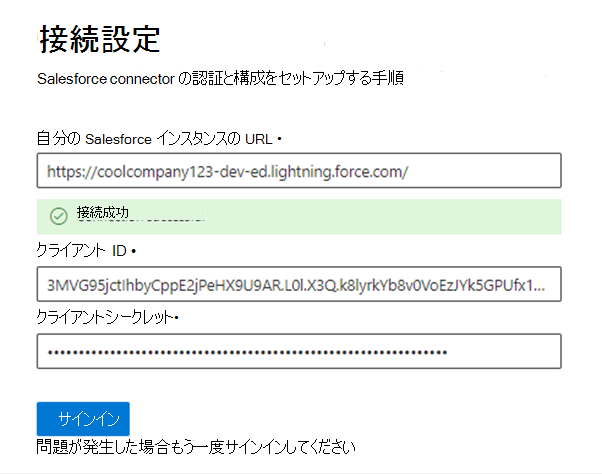

<!---Previous ms.author: rusamai --->

# Salesforce Graph コネクタ (プレビュー)

Salesforce Graph コネクタを使用すると、組織は Salesforce インスタンス内の連絡先、機会、見込み客、およびアカウントオブジェクトのインデックスを作成できます。 Salesforce からのコネクタとインデックス コンテンツを構成すると、エンド ユーザーは任意の Microsoft Search クライアントからそれらのアイテムを検索できます。

> [!NOTE]
> Graph コネクタ [**のセットアップに関する記事を読**](configure-connector.md) んで、Graph コネクタの一般的なセットアップ プロセスを理解してください。

この記事は、ServiceNow Graph コネクタを構成、実行、および監視するユーザーを対象にしています。 一般的なセットアップ プロセスを補完し、Salesforce Graph コネクタにのみ適用される手順を示します。 この記事には、制限事項に関する [情報も含まれています](#limitations)。

>[!IMPORTANT]
>Salesforce Graph コネクタは現在、夏の '19 以降をサポートしています。

## 使用を開始する前に

Salesforce インスタンスに接続するには、Salesforce インスタンスの URL、クライアント ID、および OAuth 認証用のクライアント シークレットが必要です。 次の手順では、自分または Salesforce 管理者が Salesforce アカウントからこの情報を取得する方法について説明します。

- Salesforce インスタンスにログインし、[セットアップ] に移動します。

- [アプリ] ->に移動します。

- [新しい **接続済みアプリ] を選択します**。

- API セクションを次のように完了します。

    - [Oauth の設定を有効 **にする] チェック ボックスをオンにします**。

    - コールバック URL を次のように指定します。 [https://gcs.office.com/v1.0/admin/oauth/callback](https://gcs.office.com/v1.0/admin/oauth/callback)

    - これらの必須の OAuth スコープを選択します。

        - データへのアクセスと管理 (api)

        - いつでも自分の代わりに要求を実行する (refresh_token、offline_access)

    - [Web サーバー フローにシークレット **を要求する] チェック ボックスをオンにします**。

    - アプリを保存します。
    
      > [!div class="mx-imgBorder"]
      > 

- コンシューマー キーとコンシューマー シークレットをコピーします。 この情報は、Microsoft 365 管理ポータルで Graph Connector の接続設定を構成するときに、クライアント ID およびクライアント シークレットとして使用されます。

  > [!div class="mx-imgBorder"]
  > 
  
- Salesforce インスタンスを閉じる前に、次の手順に従って更新トークンの有効期限が切れるのを確認します。
    - Go to Apps -> App Manager
    - 作成したアプリを見つけて、右側のドロップダウンを選択します。 [管理] **を選択する**
    - ポリシー **の編集を選択する**
    - 更新トークン ポリシーの場合、[更新トークンは **失効するまで有効です] を選択します。**

  > [!div class="mx-imgBorder"]
  > 

[これで、M365](https://admin.microsoft.com/)管理センターを使用して、Graph コネクタの残りのセットアップ プロセスを完了できます。

## 手順 1: Microsoft 365 管理センターで Graph コネクタを追加する

一般的なセットアップ [手順に従います](https://docs.microsoft.com/microsoftsearch/configure-connector)。
<!---If the above phrase does not apply, delete it and insert specific details for your data source that are different from general setup instructions.-->

## 手順 2: 接続に名前を付け

一般的なセットアップ [手順に従います](https://docs.microsoft.com/microsoftsearch/configure-connector)。
<!---If the above phrase does not apply, delete it and insert specific details for your data source that are different from general setup instructions.-->

## 手順 3: 接続設定を構成する

インスタンス URL には、https://[domain].my.salesforce.com を使用します。ドメインは組織の Salesforce ドメインになります。

Salesforce インスタンスから取得したクライアント ID とクライアント シークレットを入力し、[サインイン] を選択します。

これらの設定で初めてサインインしようとすると、管理者のユーザー名とパスワードを使用して Salesforce にログインを求めるポップアップが表示されます。 次のスクリーンショットはポップアップを示しています。 資格情報を入力し、[ログイン] を選択します。

  

  >[!NOTE]
  >ポップアップが表示されない場合は、ブラウザーでブロックされている可能性があります。そのため、ポップアップとリダイレクトを許可する必要があります。

次のスクリーンショットに示すように、"接続が成功しました" という緑色のバナーを検索して、接続が成功したと確認します。

  > [!div class="mx-imgBorder"]
  > 

## 手順 4: 検索権限を管理する

このデータ ソースからの検索結果を表示するユーザーを選択する必要があります。 特定の Azure Active Directory (Azure AD) または Azure 以外の AD ユーザーにのみ検索結果の表示を許可する場合は、ID をマップしてください。

## 手順 4a: アクセス許可を選択する

Salesforce インスタンスからアクセス制御リスト (ACL) を取り込むか、組織内のすべてのユーザーにこのデータ ソースからの検索結果の表示を許可することができます。 ACL には、Azure Active Directory (AAD) ID (Azure AD から Salesforce にフェデレーションされているユーザー)、Azure AD 以外の ID (Azure AD で対応する ID を持つネイティブの Salesforce ユーザー)、または両方が含まれます。

>[!NOTE]
>Ping ID や secureAuth などのサード パーティ ID プロバイダーを使用する場合は、ID の種類として "非 AAD" を選択する必要があります。

> [!div class="mx-imgBorder"]
> ![管理者が完了した [アクセス許可の選択] 画面。管理者は、[このデータ ソースにアクセスできるユーザーのみ] オプションを選択し、ID の種類のドロップダウン メニューから [AAD] も選択しています。](media/salesforce-connector/sf6.png)

Salesforce インスタンスから ACL を取り込み、ID の種類として [非 AAD] を選択した場合は、「Id のマッピング手順については [、Azure 以外の AD](map-non-aad.md) ID をマップする」を参照してください。

## 手順 4b: AAD ID をマップする

Salesforce インスタンスから ACL を取り込み、ID の種類として "AAD" を選択した場合、ID のマッピング手順については [、「Azure AD Identity](map-aad.md) をマップする」を参照してください。 Salesforce の Azure AD SSO を設定する方法については、このチュートリアルを参照 [してください](https://docs.microsoft.com/azure/active-directory/saas-apps/salesforce-tutorial)。

## 手順 5: プロパティ ラベルを割り当てる

オプションのメニューから選択すると、ソース プロパティを各ラベルに割り当てできます。 この手順は必須ではありませんが、一部のプロパティ ラベルを使用すると、検索の関連性が向上し、エンド ユーザーの検索結果が向上します。 既定では、"Title"、"URL"、"CreatedBy"、"LastModifiedBy" のようなラベルの一部には、既にソース プロパティが割り当てされています。

## 手順 6: スキーマを管理する

インデックスを作成するソース プロパティを選択して、検索結果に表示できます。 既定では、接続ウィザードはソース プロパティのセットに基づいて検索スキーマを選択します。 検索スキーマ ページの各プロパティと属性のチェック ボックスをオンにすると、変更できます。 検索スキーマ属性には、検索、クエリ、取得、絞り込みがあります。
絞り込み機能を使用すると、後でカスタム絞り込み条件またはフィルターとして使用できるプロパティを定義できます。  

> [!div class="mx-imgBorder"]
> 

## 手順 7: 更新スケジュールを設定する

Salesforce コネクタは、現在、フル クロールの更新スケジュールのみをサポートしています。

>[!IMPORTANT]
>フル クロールは、削除されたオブジェクトと、以前に Microsoft Search インデックスに同期されたユーザーを検索します。

フル クロールのスケジュールは 1 週間を推奨します。

## 手順 8: 接続を確認する

一般的なセットアップ [手順に従います](https://docs.microsoft.com/microsoftsearch/configure-connector)。
<!---If the above phrase does not apply, delete it and insert specific details for your data source that are different from general setup instructions.-->

<!---## Troubleshooting-->
<!---Insert troubleshooting recommendations for this data source-->

## 制限事項

- Graph コネクタでは、現在、Salesforce の個人グループを使用した、領域ベースの領域ベースの共有と共有はサポートされていません。
- Graph コネクタが使用する Salesforce API には既知のバグがあります。この場合、現在、見込み客のプライベートな組織全体の既定値は尊重されません。  
- フィールドにプロファイルに対してフィールド レベル セキュリティ (FLS) が設定されている場合、Graph コネクタは、その Salesforce 組織のプロファイルに対してそのフィールドを取り込まれません。その結果、ユーザーはそれらのフィールドの値を検索したり、結果に表示したりもできない可能性があります。  
- [スキーマの管理] 画面には、これらの一般的な標準プロパティ名が 1 回表示され、オプションは **クエリ**、**検索**、取得、絞り込みであり、すべてまたはなしに適用されます。
    - 名前
    - Url
    - 説明
    - FAX
    - Phone
    - MobilePhone
    - メール
    - 型
    - タイトル
    - AccountId
    - AccountName
    - AccountUrl
    - AccountOwner
    - AccountOwnerUrl
    - 所有者
    - OwnerUrl
    - CreatedBy
    - CreatedByUrl
    - LastModifiedBy
    - LastModifiedByUrl
    - LastModifiedDate
    - ObjectName
