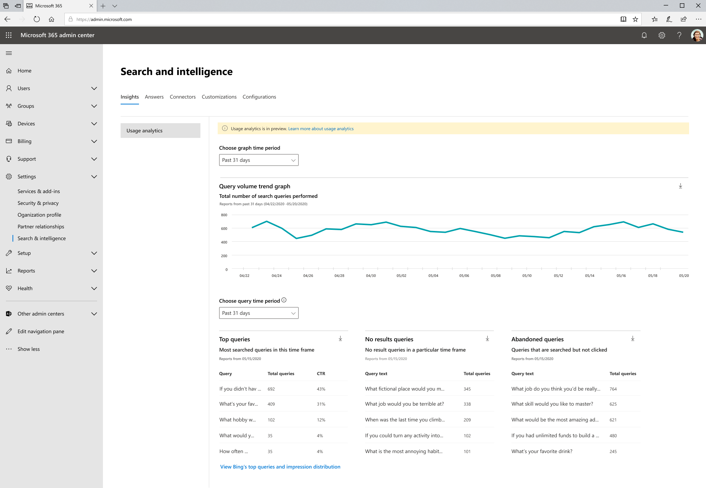

# Microsoft 検索の利用状況レポート

検索利用状況レポートを使用すると、組織内での検索の機能をより深く理解できます。 これらのレポートから生成された洞察は、 [コンテンツを検索](https://docs.microsoft.com/microsoftsearch/make-content-easy-to-find) して、ユーザーにとってより便利で delightful のような操作を実行するために役立ちます。

> [!IMPORTANT]
> Microsoft 検索利用状況レポートは現在プレビュー段階です。

[Microsoft 検索使用状況レポート](https://admin.microsoft.com/Adminportal/Home?#/MicrosoftSearch/insights)には、SharePoint ホームおよび Office.com 検索ボックスから実行される検索から生成されたグラフとテーブルが含まれています。 前月の過去31日間、1日、または毎月のデータを表示することができます。 これらのレポートは、履歴データの見越計上に時間がかかるように、ロールアウトされています。

このページの以前のバージョンには、Bing.com で Bing で Microsoft Search に対して実行された検索からのデータが含まれていました。 そのデータはすぐにこれらのレポートに統合されますが、現時点では、ページの下部にあるリンクをクリックして **Bing の上位のクエリとインプレッション配布を表示** することで、これらのレポートを表示できます。

## 検索レポートの概要

|**レポート**|**説明**|
|:-----|:-----|
|クエリボリューム|このレポートには、実行された検索クエリの数が表示されます。 このレポートを使用して、検索クエリのボリュームの傾向を特定し、検索アクティビティの高および低期間を特定します。|
|よく使用されるクエリ|このレポートには、最も人気の高い検索クエリが表示されます。 このレポートを使用して、ユーザーが検索している情報の種類を把握します。|
|破棄したクエリ|このレポートには、クリックスルーを低頻度で受信する人気の高い検索クエリが表示されます。 このレポートを使用して、ユーザー満足度の低い可能性のある検索クエリを特定し、コンテンツの検出可能性を改善します。 その後で、ブックマークなどの回答を作成するか、グラフコネクタを使用して新しいコンテンツを取り込むするかを決定できます。これは、適切な操作です。|
|結果なしのクエリ|このレポートには、結果を返さなかった人気の高い検索クエリが表示されます。 このレポートを使用して、ユーザー満足度の低い可能性のある検索クエリを特定し、コンテンツの検出可能性を改善します。 その後で、ブックマークなどの回答を作成するか、グラフコネクタを使用して新しいコンテンツを取り込むするかを決定できます。これは、適切な操作です。|

## レポートを表示する

[利用状況レポート] ページに移動すると、すべてのレポートを表示できるようになります。 日付フィルターを使用して、表示する特定の日または月を選択できます。

レポートをダウンロードすることにより、より幅広い期間のレポートを表示することができます。 ダウンロードする矢印をクリックし、[ **過去31日間** ] または [ **過去12か月**] を選択します。 レポートは、Excel スプレッドシートとしてダウンロードされます。 過去31日間を選択した場合、スプレッドシートには、各日の個別のタブが表示されます。 過去12か月間のダウンロードには、毎月1つのタブが表示されます。

Bing の上位のクエリおよびインプレッション配布レポートを表示するには、ページ上のリンクをクリックします。

## よく寄せられる質問

**過去31日間または過去12か月を選択したときに、それぞれ特定の日または特定の月を選択する必要があるのはなぜですか。**

Microsoft search 利用状況レポートの今日の予定表ビューは、2段階のプロセスです。 最初にドロップダウンから日付範囲 (過去31日間または過去12か月) を選択してから、開始日または月を選択します。

Top、放棄、および failed のクエリテーブルでは、選択した日または月の結果が表示されます。

**どのような場合に過去7日間、過去30日間の集計データが表示されます。 Bing の上位クエリレポートのようになりますか?**

この種の集約を検討しており、今後のバージョンのレポートでデータ範囲フィルター処理を簡素化しています。

**利用状況レポートの内訳を異なるアプリ (ソース) ごとに表示できないのはなぜですか?**

現在、ソースによるフィルターは使用できません。 これらのレポートは、SharePoint Home と Office.com の検索を組み合わせたものです。 次のリリースにはソースフィルターが組み込まれているため、各アプリケーションに固有の測定値を確認できます。

**利用状況レポートに関するその他のフィルター処理**

組織のより詳細なレベルでの検索の使用法を理解するために役立つ追加のフィルターを使用しています。 たとえば、特定の地域または部署のクエリボリュームを表示することができます。

**Bing レポートでの Microsoft 検索が別のページにあるのはなぜですか?**

モダン化 search in Office 365 applications for Microsoft Search では、レポートの生成を含む以前に分散したシステムに参加する必要がありました。 これには時間がかかるので、Bing データの統合が完了するまで待機することによって、今まで以上のレポートを取得することが重要であると考えています。 統合が完了すると、すべての検索エンドポイントのデータが同じレポートに含まれます。
